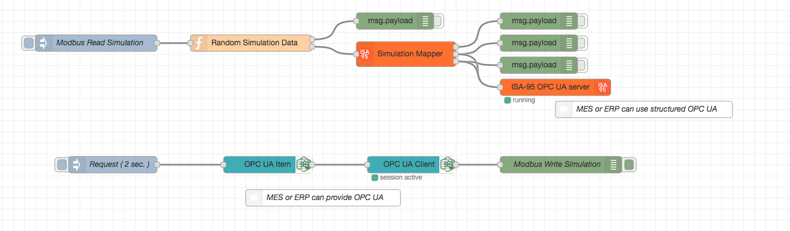

node-red-contrib-isa
========================

[Node-Red][1] Modbus node package.

Based on [node-opcua][2]

# Install

Run the following command in the root directory of your Node-RED install

    npm install @biancoroyal/node-red-contrib-isa

Run the following command for global install

    npm install -g @biancoroyal/node-red-contrib-isa

# How to use

# Author
[Klaus Landsdorf][3]

[1]:http://nodered.org/
[2]:http://node-opcua.github.io/
[3]:https://github.com/biancode
