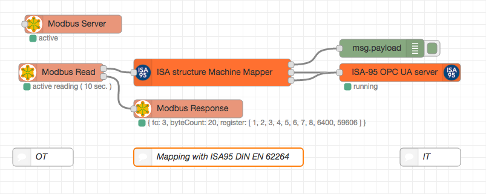

**NOT ready - just for development with node-opcua-isa95 for now!**

 

 

node-red-contrib-isa
========================

 

[Node-RED][1] ISA-95 Common Object Model mapping node package.

Based on [node-opcua][2] and [node-opcua-isa95][4]

# Install

Run the following command in the root directory of your Node-RED install

    npm install node-red-contrib-isa

Run the following command for global install

    npm install -g node-red-contrib-isa

# How to use

# Author
Copyright 2016 - [Klaus Landsdorf][3]
BSD 3-Clause License

# Important

This is **not** an official product of ISA.
It is just to provide ISA88 and ISA95 to Node-RED.
This is not production ready.

# Contribution node-opcua
I'd like to give special thanks to [Etienne Rossignon][5] for the node-opcua-isa95 package! 

[1]:http://nodered.org/
[2]:http://node-opcua.github.io/
[3]:https://github.com/biancode
[4]:https://github.com/node-opcua/node-opcua-isa95
[5]:https://github.com/erossignon
